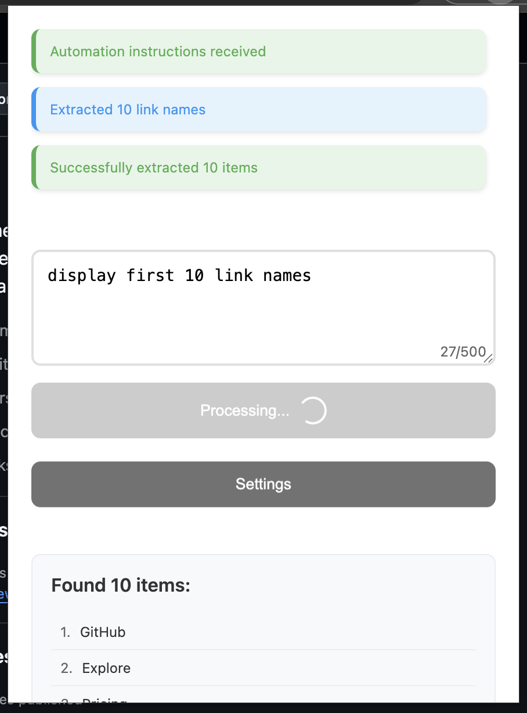

# AutoMatey

<div align="center">
  
  <br/>
  <em>A modern popup UI for automating website tasks with AI.</em>
</div>

A Chrome extension that uses AI to automate website tasks based on natural language instructions. The extension provides a modern, user-friendly interface for automating web interactions.

## Table of Contents

- [Features](#features)
- [UI Features](#ui-features)
- [Project Structure](#project-structure)
- [Setup](#setup)
- [Configuration](#configuration)
- [Usage](#usage)
- [Development](#development)
- [Contributing](#contributing)
- [Support](#support)
- [License](#license)

## Features

- Natural language interface for automation tasks
- Support for multiple AI providers (OpenAI and Groq)
- Modern and responsive UI with real-time feedback
- Automated actions:
  - Clicking elements
  - Filling forms
  - Selecting options
  - Scrolling to elements
  - Extracting data
  - Displaying messages
- Real-time feedback and status updates
- Error handling and logging
- Character counter for input validation
- Loading states and animations
- Message history management

## UI Features

- Clean and modern design with smooth animations
- Real-time character counter with visual feedback
- Loading states for better user experience
- Message history with auto-scrolling
- Color-coded status messages
- Responsive layout
- Custom scrollbars
- Hover and active states for buttons
- Error handling with visual feedback

## Project Structure

```
src/
├── background/     # Background script for handling AI requests
├── content/        # Content script for DOM interactions
├── popup/          # Popup UI and interaction
│   ├── popup.html  # Main UI template
│   ├── popup.js    # UI logic and event handling
│   ├── settings.html # Settings page template
│   └── settings.js  # Settings page logic
├── utils/          # Utility functions and helpers
└── config/         # Configuration and constants
```

## Setup

1. Clone the repository
2. Install dependencies (if any)
3. Load the extension in Chrome:
   - Open Chrome and go to `chrome://extensions/`
   - Enable "Developer mode"
   - Click "Load unpacked"
   - Select the extension directory

## Configuration

The extension requires an API key for either OpenAI or Groq. You can set this in the extension's settings:

1. Click the extension icon to open the popup
2. Click the "Settings" button
3. Choose your preferred AI provider
4. Enter your API key
5. Save the settings

## Usage

1. Click the extension icon to open the popup
2. Enter your automation request in natural language (up to 500 characters)
3. Click "Automate" to start the process
4. The extension will:
   - Show a loading state while processing
   - Analyze the current webpage
   - Generate automation instructions
   - Execute the actions
   - Display results and status updates
   - Show any extracted data in a formatted list

## Development

The extension uses ES modules and modern JavaScript features. The code is organized into modules for better maintainability:

- `background.js`: Handles AI requests and orchestrates automation
- `content.js`: Manages DOM interactions
- `popup.js`: Handles UI and user interaction
- `utils/`: Contains shared utilities and helpers
- `config/`: Contains configuration and constants

## License

MIT 